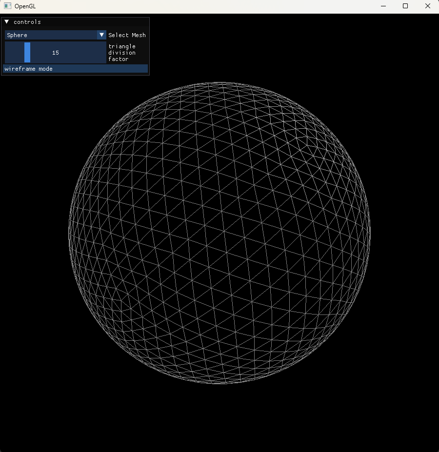
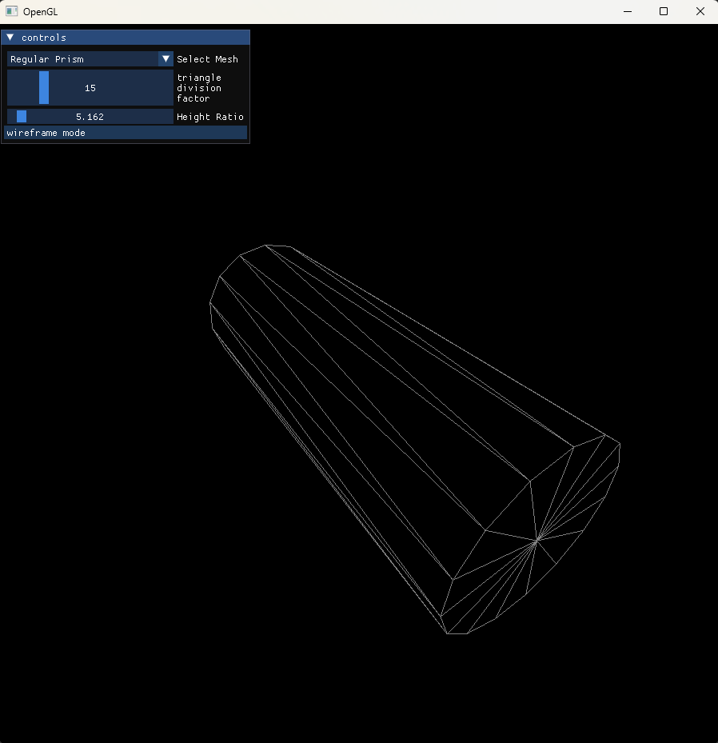

# OpenGL Playground
Repository for learning and experimenting with OpenGL. 

## Targets:

### Main
Displays a icosphere (Procedurally generated sphere from subdivision of isocahedron faces).

### Cubes
Displays 10 different cubes that can be controlled. Use keys 0-9 to select a cube, or the ¬ key to select the camera. Use WASD for controlling rotation, and arrow keys for movement.

## Building

Use CMake, build libraries from source via git submodules

#### Installing GLM
Needs to be installed before compiling the project.
cd /path/to/glm
cmake -DGLM_BUILD_TESTS=OFF -DBUILD_SHARED_LIBS=OFF -B build . -GNinja  
cmake --build build -- all  
cmake --build build -- install  